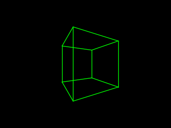
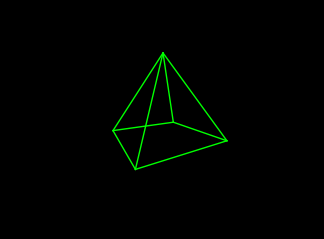
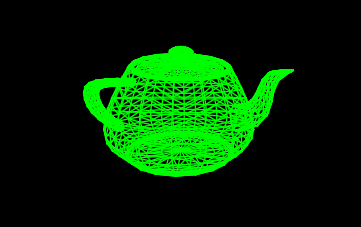
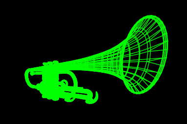
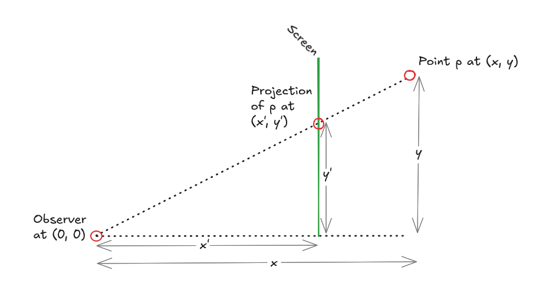

# Perspective: A Minimal 3D Rendering Engine

A minimal, educational 3D rendering engine built with Python and Matplotlib. This project demonstrates the core concepts of perspective projection to help understand how 3D objects are rendered on a 2D canvas.

## Rendered Examples

Here are some examples of the engine in action:

### Cube


### Pyramid


### Utah Teapot


### Trumpet


## The Idea

The goal of this project is **educational**: to understand and explore how 3D objects are projected onto 2D screens using perspective projection. Rather than focusing on performance or fancy features, the code prioritizes clarity and readability, making it easy to experiment with and understand the fundamental mathematics involved.

## Perspective Projection Formula

The engine uses the simplest form of perspective projection:

$$x_{proj} = \frac{x}{z}, \quad y_{proj} = \frac{y}{z}$$

Where:
- $(x, y, z)$ are the 3D coordinates
- $(x_{proj}, y_{proj})$ are the 2D projected coordinates

### Assumptions Behind This Formula

This formula works under specific geometric assumptions:

1. **Observer at origin**: The observer's eye is positioned at the world origin $(0, 0, 0)$
2. **Screen distance**: The projection screen is at a distance of 1 unit from the observer

   
- To understand where the forulas come from, have a look at theese two **similar triangles**:
   - One formed by: `eye` → `3D point` → `points projection to the bottom`
   - The other formed by: `eye` → `screen` → `projected bottom-position`
   - 
   - From here it is clear that $\frac{x'}{x} = \frac{y'}{y}$ holds, which leads under the assumption of $x' = 1$ to the above projection formulas $y' = \frac{y}{x}$. With this calculation in mind the above projection formulas for $x_{proj} and y_{proj}$ become clear.

## Architecture

The project is organized into separate modules with clear responsibilities:

### Module Overview

```
src/
├── geometry.py        # Data types: Point3D, Scene
├── transforms.py      # Transformations: rotation, normalization
├── canvas.py          # Rendering engine
├── scenes.py          # Pre-built 3D scenes
├── utils.py           # OBJ files utilities
└── main.py            # Demo and entry point
```

### Module Responsibilities

#### `geometry.py` - Data Representation
**Philosophy**: These are lightweight containers—they hold data, nothing more.

- **`Point3D`**: A simple dataclass representing a 3D point with x, y, z coordinates
- **`Scene`**: A dataclass containing a list of Point3D objects and line indices that connect them

#### `transforms.py` - Transformations
**Philosophy**: Pure transformation functions that take data in, apply math, and return transformed data.

- **`rotate_around_y(points, angle)`**: Rotates points around the Y axis at the world origin
- **`rotate_object_around_its_y_axis(points, angle)`**: Rotates points around the object's center
- **`normalize_scene(scene, distance)`**: Transforms a scene to work optimally with perspective projection:
  - Centers the scene at the origin
  - Scales so the max dimension is 1
  - Positions the object at a specified distance behind the screen

#### `canvas.py` - Rendering
**Philosophy**: Canvas is responsible for projection and visualization only. It doesn't know about specific rotations—those are provided as functions.

- **`Canvas`**: The main rendering engine
  - `load_scene(scene)`: Load a 3D scene
  - `_project(point)`: Apply perspective projection to a point
  - `render()`: Display a static 3D scene
  - `render_animated(rotation_func, iterations)`: Animate by repeatedly applying a transformation and redrawing

#### `scenes.py` - Scene Building
**Philosophy**: Easy to add new (simple) scenes without touching the rendering engine.

Pre-built 3D scenes for experimentation:
- `create_cube()`: A simple cube
- `create_pyramid()`: A simple pyramid


#### `utils.py` - OBJ File Loading
**Philosophy**: Handle Waveform OGJ files.

Utilities for loading Wavefront OBJ files:
- **`load_obj_as_scene(path)`**: Main function to load an OBJ file directly as a Scene
- **`load_obj_points_faces(path)`**: Load OBJ vertices and faces separately
- **`faces_to_edges(faces)`**: Convert face definitions to edge definitions


#### `main.py` - Entry Point
Demonstrates how to use the engine:
1. Create a Canvas
2. Create a Scene (or load one from `scenes.py`)
3. Normalize the scene for optimal projection
4. Define a rotation function
5. Render with animation

## Installation

Prerequisites: Python 3.11+

1. Clone or navigate to the project directory
2. Install dependencies using Poetry:

```bash
poetry install
```

## Running the Demo

Run the animated cube demo:

```bash
poetry run python src/main.py
```

The cube will rotate around its own center for 360 iterations (one degree per frame), displayed on a black canvas with lime green lines.

## Loading OBJ Files

The engine can load 3D models from Wavefront OBJ files. Use the utilities in `utils.py`:

```python
from utils import load_obj_as_scene
from transforms import normalize_scene
from canvas import Canvas

# Load an OBJ file
scene = load_obj_as_scene('path/to/model.obj')
scene = normalize_scene(scene)

# Render it
canvas = Canvas(width=5, height=5, focal_length=1.5)
canvas.load_scene(scene)
canvas.render()  # Static render
```

### OBJ File Format Support

- **Vertices** (`v x y z`): Full 3D coordinates
- **Faces** (`f v1 v2 v3 ...`): Vertex indices for polygonal faces (triangles, quads, n-gons)
- **Format flexibility**: Handles standard OBJ format including texture coordinates and normals (e.g., `f v/vt/vn v/vt/vn ...`)

The engine extracts all edges from the face definitions and displays them as a wireframe, which is perfect for understanding 3D structure.

## Understanding Distortion: Distance, Scale, and Focal Length

The perspective projection exhibits characteristic distortion that depends on three key parameters. Understanding how these relate to distortion helps you achieve the visual effect you want:

### Distance Parameter (in `normalize_scene()`)

Controls how far the object is positioned behind the projection screen.

```python
scene = normalize_scene(scene, distance=2.5)  # Default
```

- **Larger distance** (e.g., 5.0): Object is farther away
  - Less extreme perspective foreshortening
  - More "orthographic-like" appearance
  - Smaller apparent size on screen
  - Less distortion overall

- **Smaller distance** (e.g., 1.5): Object is closer to observer
  - More extreme perspective effects
  - Points toward the edge of FOV distort more
  - Larger apparent size on screen
  - More dramatic 3D effect

### Focal Length Parameter (in `Canvas.__init__()`)

Controls the effective "field of view" by scaling the projected coordinates. Related to camera lens focal length.

```python
canvas = Canvas(width=5, height=5, focal_length=1.5)  # Default is 1.0
```

The projection formula becomes: $x' = \frac{f \cdot x}{z}$

- **Larger focal_length** (e.g., 2.0): "Zoom in" effect
  - Narrower field of view
  - Less edge/barrel distortion
  - Objects appear closer but without extreme stretching at edges

- **Smaller focal_length** (e.g., 0.5): "Zoom out" effect
  - Wider field of view (fish-eye effect)
  - More barrel distortion at canvas edges
  - Points far from center get stretched dramatically

- **focal_length = 1.0**: Standard perspective projection (no scaling)

### Scale (implicit from normalization)

The `normalize_scene()` function scales the scene so its max dimension is 1. This interacts with distance:

- If objects are much smaller after scaling, you may need to **reduce distance** or **increase focal_length** to see them clearly
- If objects are larger, **increase distance** to see the full shape without extreme foreshortening

### Practical Tuning Guide

**For minimal distortion:**
```python
scene = normalize_scene(scene, distance=4.0)  # Far away
canvas = Canvas(width=5, height=5, focal_length=2.0)  # Zoom in
```

**For dramatic perspective effect:**
```python
scene = normalize_scene(scene, distance=1.5)  # Close
canvas = Canvas(width=5, height=5, focal_length=0.8)  # Zoom out
```

**For balanced view:**
```python
scene = normalize_scene(scene, distance=2.5)  # Default
canvas = Canvas(width=5, height=5, focal_length=1.2)  # Slight zoom
```

## Experimenting

The modular design makes it easy to experiment:

### Try a different scene:
```python
# In main.py
scene = create_pyramid()  # Instead of create_cube()
scene = normalize_scene(scene)
canvas.load_scene(scene)
```

### Load an external model:
```python
from utils import load_obj_as_scene

scene = load_obj_as_scene('models/teapot.obj')
scene = normalize_scene(scene)
canvas.load_scene(scene)
```

### Try different rotations:
```python
# Rotate around world origin instead
def rotate_frame(points: List[Point3D]) -> List[Point3D]:
    return rotate_around_y(points, 1.0)
```

### Create a new scene:
```python
# In scenes.py
def create_tetrahedron() -> Scene:
    points = [
        Point3D(0, 1, 0),
        Point3D(1, 0, 0),
        Point3D(-1, 0, 0),
        Point3D(0, 0, 1),
    ]
    lines = [(0, 1), (0, 2), (0, 3), (1, 2), (1, 3), (2, 3)]
    return Scene(points, lines)
```

### Adjust the canvas appearance:
Modify `canvas.py` to change colors, line width, background, or canvas size in the `Canvas.__init__()` method.
